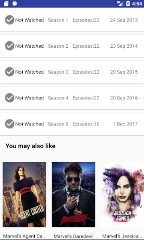
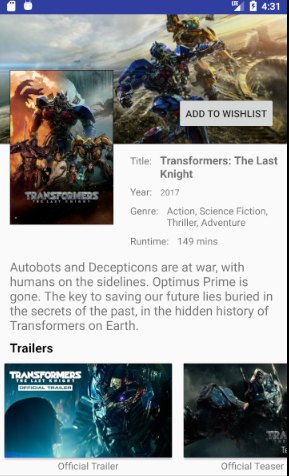
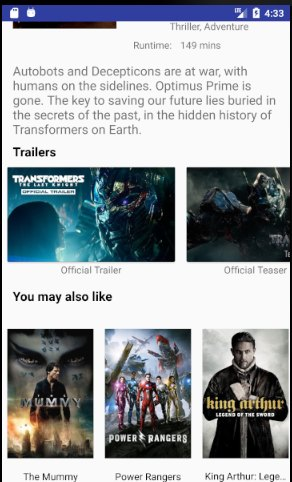
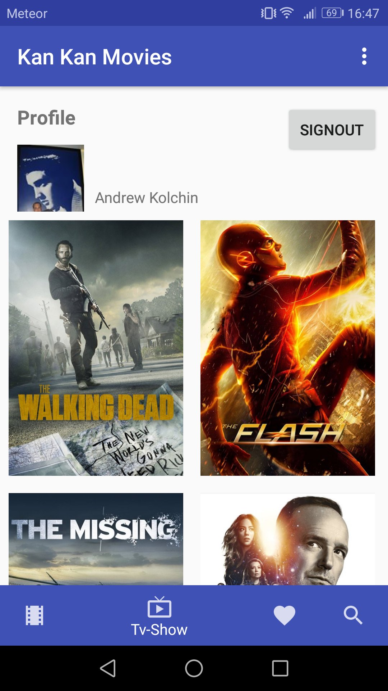
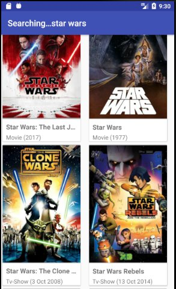

# Android-Movies-App
Android application to explore movies and TV-shows
## Description
Application that allows users to login, explore popular movies and TV-shows, watch trailers
and to save movies/tv-shows to favourite lists.
## Built using
* [Firebase](https://firebase.google.com/) authentication and Realtime Database to save user data
* [The Movies Database](https://www.themoviedb.org/) API to get movies/tv-shows data
## Libraries used
* [Retrofit](http://square.github.io/retrofit/) – the HTTP Client for Android
* [Gson](https://github.com/google/gson) – java serialization library to convert objects to JSON and back
* [Glide](https://github.com/bumptech/glide) – image loading and caching library for Android
## Pre-requisites
Android SDK, Android Studio/Eclipse IDE/etc

Minimal SDK version: 21
## Still in development
Only **Facebook Login** works at this moment
### TODO:
* [ ] TabLayout and ViewPager for Wishlist, to swipe Movies/Tv-Shows
* [ ] Display list of episodes inside TV season
* [ ] Episode details layout
* [ ] Add/Remove episode/season to/from Watchlist
* [ ] Rate movie
* [ ] Create alert for future release date
* [ ] Custom icons, optimisation, etc

## Screenshots
Tv-show Details           |  Tv-show Details 2
:-------------------------:|:-------------------------:
 |  

Movie Details           |  Movie Details 2
:-------------------------:|:-------------------------:
 |  

Main Screen: TV-Show          |  Search Screen
:-------------------------:|:-------------------------:
 |  

